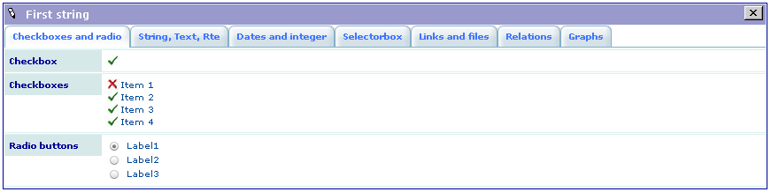

.. ==================================================
.. FOR YOUR INFORMATION
.. --------------------------------------------------
.. -*- coding: utf-8 -*- with BOM.

.. ==================================================
.. DEFINE SOME TEXTROLES
.. --------------------------------------------------
.. role::   underline
.. role::   typoscript(code)
.. role::   ts(typoscript)
   :class:  typoscript
.. role::   php(code)

Introduction
============

What does it do?
----------------

The `SAV Library Kickstarter <http://typo3.org/extensions/repository/v
iew/sav_library_kickstarter>`_ is a code generator, **developed with
“extbase” and “fluid”**, to produce Front End plugins **without any
PHP coding**, thanks to simple configuration parameters and the `SAV
Library Plus Extension
<http://typo3.org/extensions/repository/view/sav_library_plus>`_ . It
replaces the features which were added to the conventional kickstarter
using the XCLASS method in the old “sav\_library” extension which is
now obsolete. The SAV Library Kickstarter generates plugins the new
SAV Library Plus but generation for the old «sav\_library» was kept
for compatibility although it is no more maintained.

The use of “extbase” and “fluid” provides a clean and flexible
design of this kickstarter. The code generation is based on the same
template based technique as in “extension\_builder”.

The concept used in the SAV Library Plus relies on forms. A form is a
way of presenting data. It includes list view, single view or edit
view of the data. An extension may contain several forms. The
generator handles also special views like print views or update views.
Data presentation may differ from one view to another. A query is
associated with each form. Therefore, when several forms are used in
an extension, data may be different.

The SAV Library Kickstarter generates extensions which include:

- Creation of multiple views of the data,

- Front end input of the data,

- Views with folders,

- Simple interface in the Kickstarter with Context Sensitive Helps,

- Generation of emails,

- Generation of RTF files using database tags,

- Data export in the CSV format or more complex format by means of XSLT
  processing,
  
- Management of different versions of the same extension,

- Many other features.

The latest developments of the `SAV Library Kickstarter Project
<http://forge.typo3.org/projects/extension-sav_library_kickstarter>`_
and the `SAV Library Plus Project <http://forge.typo3.org/projects/extension-
sav_library_plus>`_ are available on the TYPO3 Forge.

The extension `SAV Library Example0
<http://typo3.org/extensions/repository/view/sav_library_example0>`_
was designed to test the SAV Library Kickstarter and the SAV Library
Plus extension. Other examples are also available in the TER.

Screenshots
-----------

SAV Library Example0: Generated List view
^^^^^^^^^^^^^^^^^^^^^^^^^^^^^^^^^^^^^^^^^

.. figure:: ../Images/ScreenshotsExample0ListView.png

SAV Library Example0: Generated Single view
^^^^^^^^^^^^^^^^^^^^^^^^^^^^^^^^^^^^^^^^^^^

SAV Library Example0: Generated Edit view
^^^^^^^^^^^^^^^^^^^^^^^^^^^^^^^^^^^^^^^^^

Kickstarter: Extension List
^^^^^^^^^^^^^^^^^^^^^^^^^^^

Kickstarter: “Extension configuration” section
^^^^^^^^^^^^^^^^^^^^^^^^^^^^^^^^^^^^^^^^^^^^^^

Kickstarter: “New tables” section
^^^^^^^^^^^^^^^^^^^^^^^^^^^^^^^^^

Kickstarter: “Views” section
^^^^^^^^^^^^^^^^^^^^^^^^^^^^

Kickstarter: “Queries” section
^^^^^^^^^^^^^^^^^^^^^^^^^^^^^^

Kickstarter: “Forms” section
^^^^^^^^^^^^^^^^^^^^^^^^^^^^

