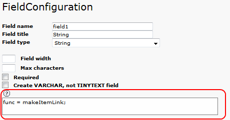

.. ==================================================
.. FOR YOUR INFORMATION
.. --------------------------------------------------
.. -*- coding: utf-8 -*- with BOM.

.. ==================================================
.. DEFINE SOME TEXTROLES
.. --------------------------------------------------
.. role::   underline
.. role::   typoscript(code)
.. role::   ts(typoscript)
   :class:  typoscript
.. role::   php(code)

Reference
=========

The TCA configuration generated by the kickstarter is available and
can be changed for each view by means of the field configuration
interface. The SAV Library makes it possible to enter data in the
Front End. However, in most cases data can also be input in the Back
End using the regular interface. In this case, the SAV Library
specific configuration are not taken into account. Configuration are
input in the text area as shown below. The size of the text area will
grow with the number of configuration lines.

The following configurations have been added for the SAV Library. They
are organized in the alphabetic order of the field type. Of course, no
type is provided for the general configuration which can be applied to
any field and to the function options. The configuration can also be
obtained directly in the kickstarter by clicking on the context
sensitive help icon (the question mark icon just above the text area).

.. important::
  If you were familiar with the use of the
  conventional kickstarter with the SAV Library, please not that field
  types were modified to provide a simpler understanding. Therefore,
  this section content is the same as in the reference section of the
  SAV Library Extension, just reorganized according to the new types.
  The upgrade feature of the SAV Library Kickstarter automatically
  changed the old types to the new ones.

Table of Contents
-----------------

.. toctree::
   :maxdepth: 5
   :titlesonly:
   :glob:

   Checkbox/Index
   Checkboxes/Index
   Date/Index
   DateAndTime/Index
   FilesAndImages/Index
   Functions/Index
   GeneralAttributes/Index
   Graph/Index
   Link/Index
   RadioButtons/Index
   Relation_1_n/Index
   Relation_n_n/Index
   RichTextEditor/Index
   Selectorbox/Index
   String/Index
   Textarea/Index
